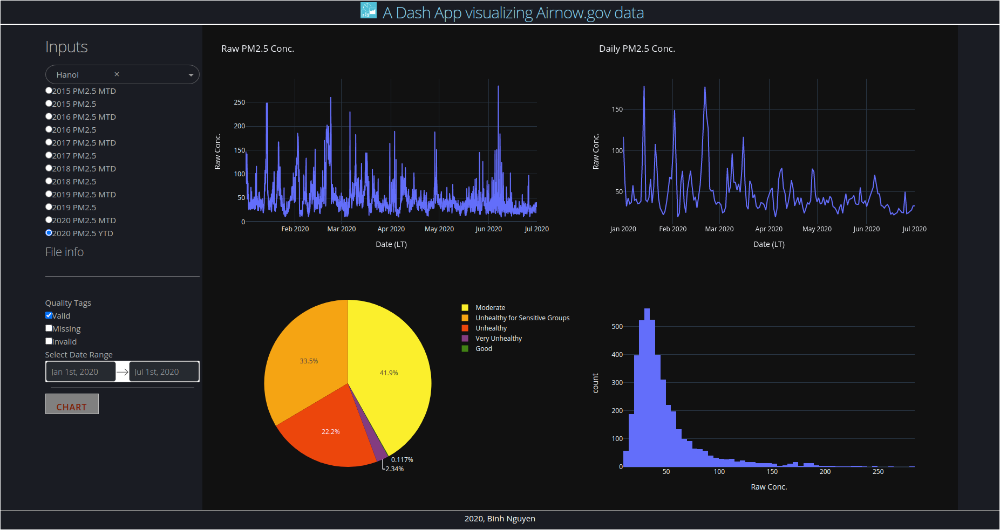

# airnow-visualize
A Dash App using Plotly and Python (and others) to visualize data from Airnow.gov

## install
- requirement: `python3.6 or later`
```
git clone https://github.com/binh-bk/airnow-visualize.git
cd airnow-visualize
python3 -m venv venv
source venv/bin/activate
pip install -r requirements.txt
gunicorn app:server
```
the app should boot up, by default, the local address is `localhost:8000`

## screenshot

  <p align="center">
    
  </p
