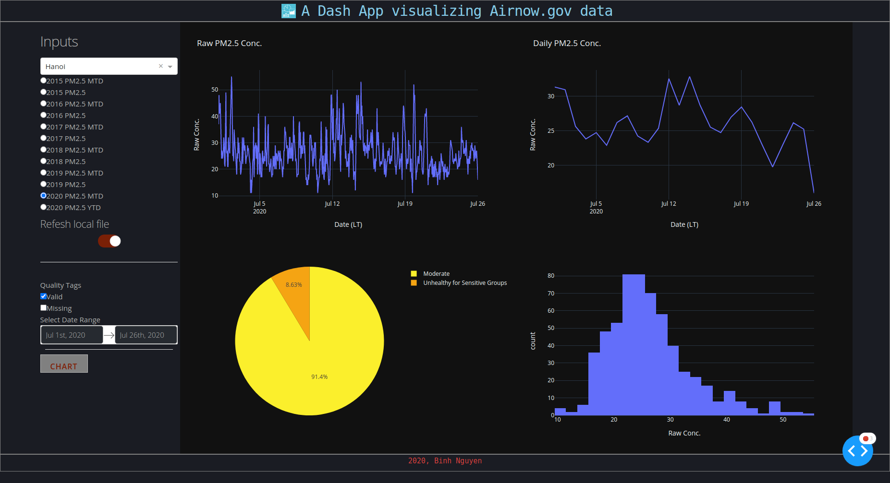

# airnow-visualize
A Dash App using Plotly and Python (and others) to visualize data from Airnow.gov

## install
- requirement: `python3.6 or later`
```
git clone https://github.com/binh-bk/airnow-visualize.git
cd airnow-visualize
python3 -m venv venv
source venv/bin/activate
pip install -r requirements.txt
gunicorn app:server
```
the app should boot up, by default, the local address is `localhost:8000`

- to stop the app, press `Ctrl + C`
- to run the app in the background `gunicorn app:server &`
- to run the app in a server with two workers `gunicorn app:server --workers 2 --bind 0.0.0.0:8000`

## refresh local file
- by default, file will be donwloaded and saved to a local folder call `csv`
- an **boolean** switch is added, and when activated showing `cherry red` background, the newest CSV file will be downloaded, and replaces the existed file
- unless you want to most recent data (updated by monthly in `YTD`, and daily in `MTD`), using local files should be fine, and much faster

## Also, a free deployment on Heroku:
[https://airnow-visualize.herokuapp.com](https://airnow-visualize.herokuapp.com/)
## screenshot

  <p align="center">
    
  </p
